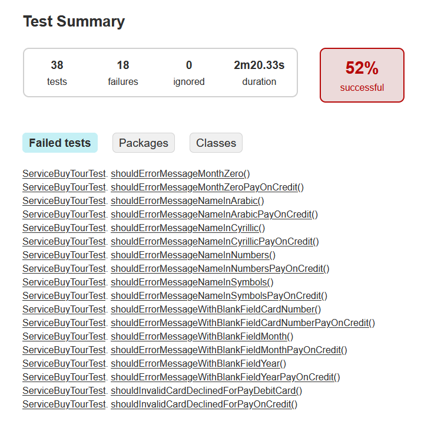
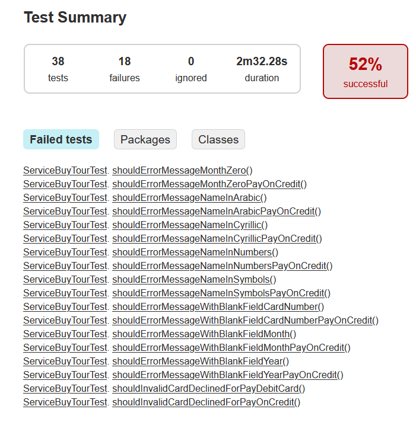

### По результатам автоматизации выполнены UI-тесты, проверена поддержка двух СУБД (MySQL, PostgreSQL), получены репорты Gradle. Автоматизированных тест-кейсов - 38. ###

## При подключении к MySQL ##  
  

Успешных - 20;  
Неуспешных - 18.  

## При подключении к PostgreSQL ##  
  

Успешных - 20;  
Неуспешных - 18.  
## Общие рекомендации ##  
- Устранить дефекты (см. issues);
- Добавить атрибут data-test-id для полей формы отправки. 
